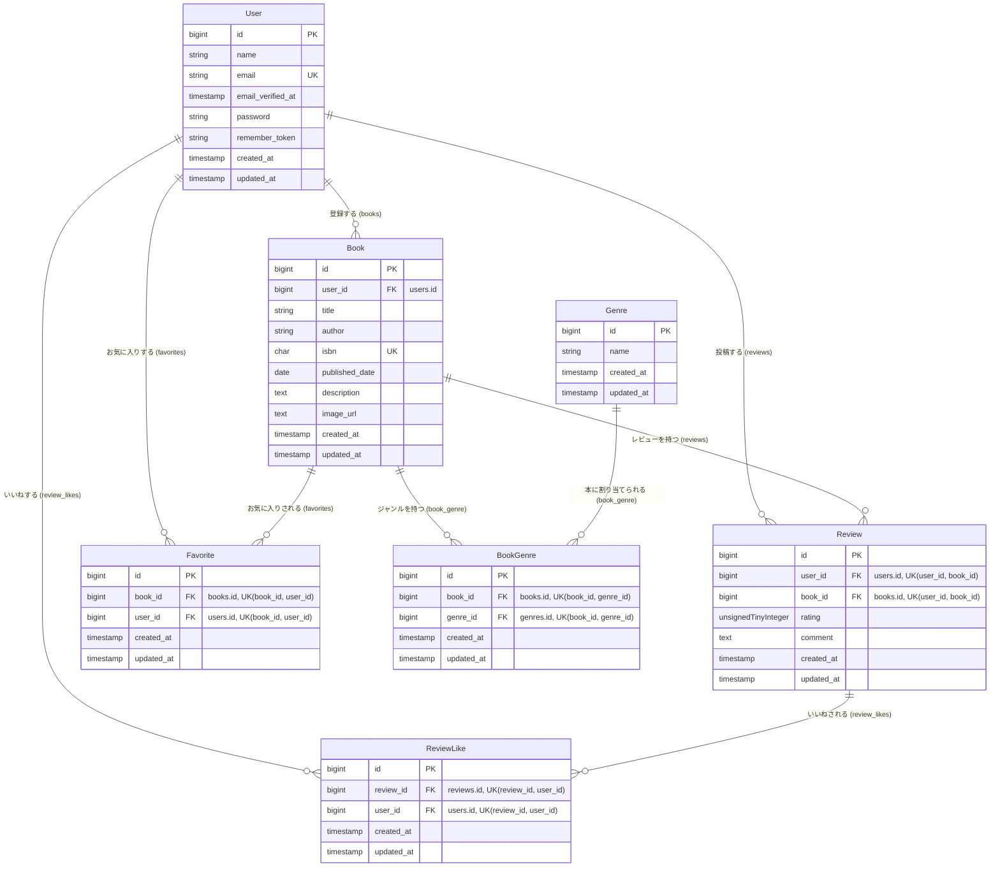

#  BookShelf　書籍レビューアプリ

## 環境構築

**git cloneでソースをローカル環境にダウンロード**
---
1. プロジェクトを作成したいフォルダに移動してgit cloneでダウンロード
```bash
git clone git@github.com:NobuyoshiShimada/BookShelf-App.git
```
2. プロジェクトディレクトリに移動
```bash
cd bookshelf-app
```

**Laravel sailをインストール**
---
3. Laravel Sailをインストール
```bash
docker run --rm -u "$(id -u):$(id -g)" -v "$(pwd):/var/www/html" -w /var/www/html -e COMPOSER_CACHE_DIR=/tmp/composer_cache laravelsail/php82-composer:latest composer require laravel/sail --dev
```
4. sailの設ファイルを生成する（MySQLを選択）
```bash
docker run --rm -u "$(id -u):$(id -g)" -v "$(pwd):/var/www/html" -w /var/www/html -e COMPOSER_CACHE_DIR=/tmp/composer_cache laravelsail/php82-composer:latest php artisan sail:install --with=mysql`
```
> *MacのM1・M2チップのPCの場合、`no matching manifest for linux/arm64/v8 in the manifest list entries`のメッセージが表示されビルドができないことがあります。
エラーが発生する場合は、docker-compose.ymlファイルの「mysql」内に「platform」の項目を追加で記載してください*

``` bash
mysql:
    platform: linux/x86_64(←この文を追加)
    image: mysql:8.0.26
    environment:
```

**.envファイルの設定**

5. .env ファイルを開き、データベース接続情報が以下と一致していることを確認します。
```bash
DB_CONNECTION=mysql
DB_HOST=mysql
DB_PORT=3306
DB_DATABASE=laravel
DB_USERNAME=sail
DB_PASSWORD=password
```
**重要**: DB_HOST は localhost や 127.0.0.1 ではなく、Dockerコンテナ名である **mysql** を指定します。

**フロントエンドのセットアップ（Vite & Tailwind CSS）**
---
> 本プロジェクトでは、フロントエンドのスタイリングにTailwind CSSを使用します。
以下の手順でセットアップを行ってください。

6. NPM依存パッケージのインストール
```bash
sail npm install
```
※Sailコンテナが起動していることを確認。起動していない場合は ./vendor/bin/sail up -d を実行

7. Alpine.jsのインストール
```bash
sail npm install alpinejs
```

8. Tailwind CSSと @tailwindcss/forms プラグインのインストール
```bash
sail npm install -D tailwindcss@^3.4.0 @tailwindcss/forms postcss autoprefixer
```
※ @tailwindcss/forms はフォーム要素のスタイルをリセットするLaravel標準プラグインです。

9. 設定ファイルの生成
```bash
sail npx tailwindcss init -p
```

10. Tailwind CSSのテンプレートパス設定とforms プラグインの有効化
tailwind.config.js を以下の内容で上書きしてください：
```
import defaultTheme from 'tailwindcss/defaultTheme';
import forms from '@tailwindcss/forms';

/** @type {import('tailwindcss').Config} */
export default {
    content: [
        './vendor/laravel/framework/src/Illuminate/Pagination/resources/views/*.blade.php',
        './storage/framework/views/*.php',
        './resources/views/**/*.blade.php',
    ],
    theme: {
        extend: {
            fontFamily: {
                sans: ['Figtree', ...defaultTheme.fontFamily.sans],
            },
        },
    },
    plugins: [forms],
};`
```

11. Vite開発サーバーの起動
```bash
sail npm run dev
```
注意: 開発中は常にこのコマンドを実行した状態にしておいてください。

**phpMyAdminの追加**
---
12. compose.yaml を開き、mysql サービスの後に以下の設定を追加してください。
```bash
phpmyadmin:
    image: 'phpmyadmin:latest'
    ports:
        - '${FORWARD_PHPMYADMIN_PORT:-8080}:80'
    environment:
        PMA_HOST: mysql
        PMA_USER: '${DB_USERNAME}'
        PMA_PASSWORD: '${DB_PASSWORD}'
    networks:
        - sail
    depends_on:
        - mysql
```

**Sailの起動とエイリアス設定**
---
13. Sailをバックグラウンドで起動
```bash
./vendor/bin/sail up -d
```

14.  エイリアスを設定して 'sail' だけでコマンドを実行できるようにする
```bash
echo "alias sail='[ -f sail ] && bash sail || bash vendor/bin/sail'" >> ~/.zshrc
```

15. シェルを再起動するか、新しいターミナルを開いてエイリアスを有効にする
```bash
exec $SHELL
```

16. アプリケーションキーの作成
``` bash
sail artisan key:generate
```

17. マイグレーションの実行
``` bash
sail artisan migrate --seed
```
> ※既存のデータベースをリセットしたい場合は以下を実行してください。
**`sail artisan migrate:fresh --seed`**

## 使用技術(実行環境)
- macOS Swquoia 15.6
- PHP 8.5.7
- Laravel 10.50.2
- DB: MySQL 8.4.11
- フロントエンド: Vite, Tailwind CSS ^3.4.0, @tailwindcss/forms
- 開発ツール: Docker, Laravel Sail, phpMyAdmin,Postman

## URL
- 開発環境：http://localhost/books
- phpMyAdmin:：http://localhost:8080/

## 作成者
島田 延佳

( Nobuyoshi Shimada )

## テーブル仕様

### 1. users テーブル（ユーザー管理）

| カラム名 | データ型 | 制約 | 説明 |
| :--- | :--- | :--- | :--- |
| **id** | bigint | Primary Key, Auto Increment | ユーザーID |
| **name** | string | Not Null | ユーザー名 |
| **email** | string | Not Null, Unique | メールアドレス |
| **email_verified_at** | timestamp | Nullable | メール確認日時 |
| **password** | string | Not Null | ハッシュ化パスワード |
| **remember_token** | string | Nullable | ログイン保持トークン |
| **created_at** | timestamp | Not Null | レコード作成日時 |
| **updated_at** | timestamp | Not Null | レコード更新日時 |


### 2. books テーブル（書籍管理）

| カラム名 | データ型 | 制約 | 説明 |
| :--- | :--- | :--- | :--- |
| **id** | bigint | Primary Key, Auto Increment | 書籍ID |
| **user_id** | bigint | Foreign Key (users.id), Cascade Delete | 登録ユーザーID |
| **title** | string | Not Null | 書籍タイトル |
| **author** | string | Not Null | 著者名 |
| **isbn** | char(13) | Not Null, Unique | ISBNコード (13桁数字) |
| **published_date** | date | Not Null | 出版日 |
| **description** | text | Nullable | 書籍の説明・概要 |
| **image_url** | text | Nullable | 表紙画像のURL |
| **created_at** | timestamp | Not Null | レコード作成日時 |
| **updated_at** | timestamp | Not Null | レコード更新日時 |


### 3. reviews テーブル（レビュー管理）

| カラム名 | データ型 | 制約 | 説明 |
| :--- | :--- | :--- | :--- |
| **id** | bigint | Primary Key, Auto Increment | レビューID |
| **user_id** | bigint | Foreign Key (users.id), Cascade Delete | 投稿ユーザーID |
| **book_id** | bigint | Foreign Key (books.id), Cascade Delete | 対象の書籍ID |
| **rating** | unsignedTinyInteger | Not Null (1〜5) | 5段階評価の点数 |
| **comment** | text | Not Null | レビュー本文 |
| **created_at** | timestamp | Not Null | レコード作成日時 |
| **updated_at** | timestamp | Not Null | レコード更新日時 |
| **-** | - | Unique Key (`user_id`, `book_id`) | 1人1冊のみ投稿可能にする制約 |


### 4. genres テーブル（ジャンル管理）

| カラム名 | データ型 | 制約 | 説明 |
| :--- | :--- | :--- | :--- |
| **id** | bigint | Primary Key, Auto Increment | ジャンルID |
| **name** | string | Not Null | ジャンル名 (SF, 技術書など) |
| **created_at** | timestamp | Not Null | レコード作成日時 |
| **updated_at** | timestamp | Not Null | レコード更新日時 |


### 5. book_genre テーブル（書籍とジャンルの中間テーブル）

| カラム名 | データ型 | 制約 | 説明 |
| :--- | :--- | :--- | :--- |
| **id** | bigint | Primary Key, Auto Increment | 中間レコードID |
| **book_id** | bigint | Foreign Key (books.id), Cascade Delete | 書籍ID |
| **genre_id** | bigint | Foreign Key (genres.id), Cascade Delete | ジャンルID |
| **created_at** | timestamp | Not Null | レコード作成日時 |
| **updated_at** | timestamp | Not Null | レコード更新日時 |
| **-** | - | Unique Key (`book_id`, `genre_id`) | 同一ジャンルの重複登録を防ぐ制約 |


### 6. favorites テーブル（書籍のお気に入り中間テーブル）

| カラム名 | データ型 | 制約 | 説明 |
| :--- | :--- | :--- | :--- |
| **id** | bigint | Primary Key, Auto Increment | お気に入りID |
| **book_id** | bigint | Foreign Key (books.id), Cascade Delete | 対象の書籍ID |
| **user_id** | bigint | Foreign Key (users.id), Cascade Delete | お気に入りしたユーザーID |
| **created_at** | timestamp | Not Null | レコード作成日時 |
| **updated_at** | timestamp | Not Null | レコード更新日時 |
| **-** | - | Unique Key (`book_id`, `user_id`) | 同一書籍の重複お気に入りを防ぐ制約 |


### 7. review_likes テーブル（レビューのいいね中間テーブル）

| カラム名 | データ型 | 制約 | 説明 |
| :--- | :--- | :--- | :--- |
| **id** | bigint | Primary Key, Auto Increment | いいねID |
| **review_id** | bigint | Foreign Key (reviews.id), Cascade Delete | 対象のレビューID |
| **user_id** | bigint | Foreign Key (users.id), Cascade Delete | いいねしたユーザーID |
| **created_at** | timestamp | Not Null | レコード作成日時 |
| **updated_at** | timestamp | Not Null | レコード更新日時 |
| **-** | - | Unique Key (`review_id`, `user_id`) | 同一レビューの重複いいねを防ぐ制約 |


## ER図


## 公開APIエンドポイント一覧

すべてのAPIルートは認証不要でアクセス可能です。ベースURL（例: `http://127.0.0`）に続けて以下のパスをリクエストしてください。

### 書籍管理API (v1/books)

| メソッド | パス | 機能概要 | クエリパラメータ / リクエストボディ |
| :--- | :--- | :--- | :--- |
| **GET** | `/v1/books` | 書籍一覧の取得 (10件ペジネーション) | `keyword` (検索ワード), `genre_id` (ジャンル絞り込み), `per_page` (最大100) |
| **POST** | `/v1/books` | 新しい書籍の登録 (登録時のuser_idは固定値999) | `title`, `author`, `isbn` (13桁数字), `published_date`, `description`, `image_url`, `genres` (配列) |
| **GET** | `/v1/books/{book}` | 特定の書籍の検索・詳細情報取得 | パスパラメータに書籍の `id` を指定 |
| **PUT** | `/v1/books/{book}` | 既存の書籍情報の更新 | `title`, `author`, `isbn`, `published_date`, `description`, `image_url`, `genres` (配列) |
| **DELETE** | `/v1/books/{book}` | 書籍の削除 (関連レビュー、中間テーブルも連動削除) | パスパラメータに書籍の `id` を指定 |

## テストアカウント

name:山田 太郎

email:yamada@example.com

password:password

---

name:鈴木 花子

email:suzuki@example.com

password:password

## テストの実行方法（PHPUnit）

本システムでは、PHPUnitおよびLaravelのテスト機能を活用して、アプリケーションの品質（Web画面、公開API、認証機能、データ構造など）をテストしています。


### 1. テストの実行コマンド
---
状況に応じて以下のコマンドを使い分けてテストを実行します。

- **すべてのテストを一括実行する:**
  ```bash
  sail artisan test
  ```

- **特定のテストファイルのみを個別に実行する:**
  ```bash
  # モデルのリレーションテスト
  sail artisan test tests/Unit/Models

  # 各モデルの単体テスト
  sail artisan test tests/Unit/Models/ExampleTest.php

  # 機能のテスト
  sail artisan test tests/Feature/Web

    # 各機能のテスト
  sail artisan test tests/Feature/Web/ExampleTest.php

  # 公開API機能のテスト
  sail artisan test tests/Feature/Api/V1/BookCudTest.php
  ```

### 2. カバレッジの計測 ### 
---
1. .env ファイルを開き、下記の一行を加えてください。
```bash
SAIL_XDEBUG_MODE=coverage
```

2. この設定は起動時に読み込まれるため、いったんコンテナを再起動します。
```bash
sail down
sail up -d
```

3. カバレッジテストを実行
```bash
sail artisan test --coverage
```
> --min=60 を付けると、全体のカバレッジが 60% に満たない場合にコマンドが失敗 します。下限を自動で守りたいときに使います。
`sail artisan test --coverage --min=60`

- `**Xdebug の coverage モードはテストの実行を遅くします。ふだんの開発では SAIL_XDEBUG_MODE を空に戻し（または off にし）、カバレッジを測るときだけ有効にすると快適です。設定を変えたら、その都度コンテナの再起動が必要です。**`

