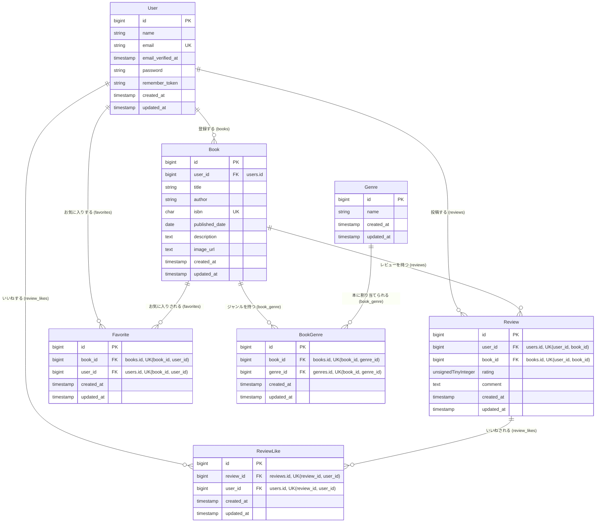

# BookShelf　書籍レビューアプリ

**概要**

書籍レビューアプリケーション「BookShelf」です。
ジャンルによる分類やレビューへのいいね機能、平均評価に基づくランキング機能も備えています。
- ユーザーは書籍を登録・閲覧し、レビューの投稿やお気に入り登録ができます。
- 外部アプリケーション向けの公開API（JSON）も提供します。
---
## URL
- **アプリケーションTOP**: [http://localhost](http://localhost)
- **データベース管理（phpMyAdmin）**: [http://localhost:8080/](http://localhost:8080/)
---
## 検証用テストアカウント

### 1. 山田 太郎（全機能・リマインダー検証用メインアカウント）
* **Email**: `yamada@example.com`
* **Password**: `password`

---
## 使用技術(開発環境)
- **OS** : macOS Sequoia 15.6
- **Language** : PHP 8.5.7
- **Framework** : Laravel 10.50.2
- **Database** : MySQL 8.4.11
- **Frontend** : Vite, Tailwind CSS ^3.4.0, @tailwindcss/forms
- **Tools** : Docker, Laravel Sail, phpMyAdmin, Postman
---
## 環境構築
### git cloneでソースをローカル環境にダウンロード

1. プロジェクトを作成したいフォルダに移動してgit cloneでダウンロード

- (基本機能のブランチはBasicです。応用機能追加したブランチはmain、Advancedです。そのまま環境構築するとmainブランチでダウンロードされます。)
```bash
git clone https://github.com/NobuyoshiShimada/BookShelf-App.git
```
2. プロジェクトディレクトリに移動
```bash
cd bookshelf-app
```
3. 基本機能ブランチに移動
```bash
cd switch Basic
```

### .envファイルの設定

4. .envファイルを作成する
```bash
cp .env.example
```

5. .env ファイルを開き、データベース接続情報が以下と一致していることを確認します。
```bash
DB_CONNECTION=mysql
DB_HOST=mysql
DB_PORT=3306
DB_DATABASE=laravel
DB_USERNAME=sail
DB_PASSWORD=password
```
重要: DB_HOST は localhost や 127.0.0.1 ではなく、Dockerコンテナ名である `mysql` を指定します。

### Laravel sailをインストール

6. Laravel Sailをインストール
```bash
docker run --rm -u "$(id -u):$(id -g)" -v "$(pwd):/var/www/html" -w /var/www/html -e COMPOSER_CACHE_DIR=/tmp/composer_cache laravelsail/php82-composer:latest composer require laravel/sail --dev
```

7. sailの設定ファイルを生成する（MySQLを選択）
```bash
docker run --rm -u "$(id -u):$(id -g)" -v "$(pwd):/var/www/html" -w /var/www/html -e COMPOSER_CACHE_DIR=/tmp/composer_cache laravelsail/php82-composer:latest php artisan sail:install --with=mysql
```
> *MacのM1・M2チップのPCの場合、no matching manifest for linux/arm64/v8 in the manifest list entriesのメッセージが表示されビルドができないことがあります。 エラーが発生する場合は、docker-compose.ymlファイルの「mysql」内に「platform」の項目を追加で記載してください*
``` bash
mysql:
    platform: linux/amd64(←この文を追加)
    image: mysql:8.0.26
    environment:
```

### Sailの起動とエイリアス設定

8. Sailをバックグラウンドで起動
```bash
./vendor/bin/sail up -d
```

9.  エイリアスを設定して 'sail' だけでコマンドを実行できるようにする
```bash
echo "alias sail='[ -f sail ] && bash sail || bash vendor/bin/sail'" >> ~/.zshrc
```

10. シェルを再起動するか、新しいターミナルを開いてエイリアスを有効にする
```bash
exec $SHELL
```

11. アプリケーションキーの作成
``` bash
sail artisan key:generate
```

12. マイグレーションの実行
``` bash
sail artisan migrate --seed
```
※既存のデータベースをリセットしたい場合は以下を実行してください。
`sail artisan migrate:fresh --seed`

### フロントエンドのセットアップ（Vite & Tailwind CSS）

> 本プロジェクトでは、フロントエンドのスタイリングにTailwind CSSを使用します。
以下の手順でセットアップを行ってください。

13. NPM依存パッケージのインストール
```bash
sail npm install
```
※Sailコンテナが起動していることを確認。起動していない場合は ./vendor/bin/sail up -d を実行

14. Alpine.jsのインストール
```bash
sail npm install alpinejs
```

15. Tailwind CSSと @tailwindcss/forms プラグインのインストール
```bash
sail npm install -D tailwindcss@^3.4.0 @tailwindcss/forms postcss autoprefixer
```
※ @tailwindcss/forms はフォーム要素のスタイルをリセットするLaravel標準プラグインです。

16. 設定ファイルの生成
```bash
sail npx tailwindcss init -p
```

17. Tailwind CSSのテンプレートパス設定とforms プラグインの有効化
tailwind.config.js を以下の内容で上書きしてください：
```
import defaultTheme from 'tailwindcss/defaultTheme';
import forms from '@tailwindcss/forms';

/** @type {import('tailwindcss').Config} */
export default {
    content: [
        './vendor/laravel/framework/src/Illuminate/Pagination/resources/views/*.blade.php',
        './storage/framework/views/*.php',
        './resources/views/**/*.blade.php',
    ],
    theme: {
        extend: {
            fontFamily: {
                sans: ['Figtree', ...defaultTheme.fontFamily.sans],
            },
        },
    },
    plugins: [forms],
};
```

18. Vite開発サーバーの起動
```bash
sail npm run dev
```
注意: 開発中は常にこのコマンドを実行した状態にしておいてください。

---
## 公開APIエンドポイント一覧

すべてのAPIルートは認証不要でアクセス可能です。ベースURL（例: `http://127.0.0`）に続けて以下のパスをリクエストしてください。

### 書籍管理API (v1/books)

| メソッド | パス | 機能概要 | クエリパラメータ / リクエストボディ |
| :--- | :--- | :--- | :--- |
| **GET** | `/v1/books` | 書籍一覧の取得 (10件ペジネーション) | `keyword` (検索ワード), `genre_id` (ジャンル絞り込み), `per_page` (最大100) |
| **POST** | `/v1/books` | 新しい書籍の登録 (登録時のuser_idは固定値999) | `title`, `author`, `isbn` (13桁数字), `published_date`, `description`, `image_url`, `genres` (配列) |
| **GET** | `/v1/books/{book}` | 特定の書籍の検索・詳細情報取得 | パスパラメータに書籍の `id` を指定 |
| **PUT** | `/v1/books/{book}` | 既存の書籍情報の更新 | `title`, `author`, `isbn`, `published_date`, `description`, `image_url`, `genres` (配列) |
| **DELETE** | `/v1/books/{book}` | 書籍の削除 (関連レビュー、中間テーブルも連動削除) | パスパラメータに書籍の `id` を指定 |


---
## テストの実行方法（PHPUnit）
本システムでは、PHPUnitおよびLaravelのテスト機能を活用して、アプリケーションの品質（Web画面、公開API、認証機能、データ構造など）をテストしています。
### 1. テストの実行コマンド
状況に応じて以下のコマンドを使い分けてテストを実行します。
- **すべてのテストを一括実行する:**
  ```bash
  sail artisan test
  ```
- **特定のテストファイルのみを個別に実行する:**
  ```bash
  # モデルのリレーションテスト
  sail artisan test tests/Unit/Models

  # 各モデルの単体テスト
  sail artisan test tests/Unit/Models/ExampleTest.php

  # 機能のテスト
  sail artisan test tests/Feature/Web

  # 各機能のテスト
  sail artisan test tests/Feature/Web/ExampleTest.php

  # 公開API機能のテスト
  sail artisan test tests/Feature/Api/V1/BookCudTest.php
  ```
### 2-a. カバレッジを出力しない時
- 通常の開発や、単にテストが成功（`PASS`）するかどうかを確認したい時は、Xdebugを無効化して実行します。
1. `.env` ファイルで `SAIL_XDEBUG_MODE` を空（または `off`）にします。
```env
SAIL_XDEBUG_MODE=off
```
2. 設定を反映するため、コンテナを再起動します（※設定変更時のみ必須）。
```bash
sail down && sail up -d
```
3. テストを実行します。
```bash
# 全件一括実行
sail artisan test

# 特定のファイルをピンポイント実行（例：書籍検索・ソート）
sail artisan test tests/Feature/Web/AdvancedBookSearchSortTest.php
```
### 2-b. カバレッジを出力する時（計測モード）
- 機能追加やリファクタリングが一段落し、**「テストがコードの何％を網羅しているか」を測定・出力したい時**のみ、Xdebugを有効化します。

1. `.env` ファイルを開き、以下の通り設定します。
```env
SAIL_XDEBUG_MODE=coverage
```
2. 設定を読み込ませるため、コンテナを再起動します。
```bash
sail down && sail up -d
```
3. カバレッジテストを実行します。
```bash
# 最適化キャッシュをクリアした上で実行
sail artisan optimize:clear
sail artisan test --coverage
```
> 💡 **下限ガード（`--min=60`）の活用**
> 全体のカバレッジが目標の **60%** に満たない場合に自動的にテストコマンドを失敗（FAIL）させ、コード品質の低下を防ぐことができます。
> `sail artisan test --coverage --min=60`
### 3. 品質レポート（HTML）の出力先と確認方法
- カバレッジテスト（計測モード）を実行すると、どのファイルのどの行がテストを通過したかをブラウザで視覚的に確認できる **HTML形式のグラフィカルな品質レポート** が自動生成されます。

**HTMLレポートの生成コマンド:**
  ```bash
  # テストを実行し、コンテナ内の特定のディレクトリへHTMLレポートを出力します
  sail artisan test --coverage-html html-report
  ```

**品質レポートの出力先（ファイルパス）:**
  プロジェクトルート直下に生成される以下のフォルダ内の **`index.html`** です。
  ```text
  📁 html-report/index.html
  ```

**確認方法:**
  Finder（Mac）やエクスプローラーから、ご自身のPCのローカルにある `html-report/index.html` をダブルクリックしてブラウザ（ChromeやSafari）で開いてください。
  システム全体のコード網羅率が1目でわかり、緑（テスト通過）や赤（未通過の行）に色分けされた詳細な品質レポートを閲覧できます。

---
## テーブル仕様

### 1. users テーブル（ユーザー管理）

| カラム名 | データ型 | 制約 | 説明 |
| :--- | :--- | :--- | :--- |
| **id** | bigint | Primary Key, Auto Increment | ユーザーID |
| **name** | string | Not Null | ユーザー名 |
| **email** | string | Not Null, Unique | メールアドレス |
| **email_verified_at** | timestamp | Nullable | メール確認日時 |
| **password** | string | Not Null | ハッシュ化パスワード |
| **remember_token** | string | Nullable | ログイン保持トークン |
| **created_at** | timestamp | Not Null | レコード作成日時 |
| **updated_at** | timestamp | Not Null | レコード更新日時 |

### 2. books テーブル（書籍管理）

| カラム名 | データ型 | 制約 | 説明 |
| :--- | :--- | :--- | :--- |
| **id** | bigint | Primary Key, Auto Increment | 書籍ID |
| **user_id** | bigint | Foreign Key (users.id), Cascade Delete | 登録ユーザーID |
| **title** | string | Not Null | 書籍タイトル |
| **author** | string | Not Null | 著者名 |
| **isbn** | char(13) | Not Null, Unique | ISBNコード (13桁数字) |
| **published_date** | date | Not Null | 出版日 |
| **description** | text | Nullable | 書籍の説明・概要 |
| **image_url** | text | Nullable | 表紙画像のURL |
| **created_at** | timestamp | Not Null | レコード作成日時 |
| **updated_at** | timestamp | Not Null | レコード更新日時 |


### 3. reviews テーブル（レビュー管理）

| カラム名 | データ型 | 制約 | 説明 |
| :--- | :--- | :--- | :--- |
| **id** | bigint | Primary Key, Auto Increment | レビューID |
| **user_id** | bigint | Foreign Key (users.id), Cascade Delete | 投稿ユーザーID |
| **book_id** | bigint | Foreign Key (books.id), Cascade Delete | 対象の書籍ID |
| **rating** | unsignedTinyInteger | Not Null (1〜5) | 5段階評価の点数 |
| **comment** | text | Not Null | レビュー本文 |
| **created_at** | timestamp | Not Null | レコード作成日時 |
| **updated_at** | timestamp | Not Null | レコード更新日時 |
| **-** | - | Unique Key (`user_id`, `book_id`) | 1人1冊のみ投稿可能にする制約 |


### 4. genres テーブル（ジャンル管理）

| カラム名 | データ型 | 制約 | 説明 |
| :--- | :--- | :--- | :--- |
| **id** | bigint | Primary Key, Auto Increment | ジャンルID |
| **name** | string | Not Null | ジャンル名 (SF, 技術書など) |
| **created_at** | timestamp | Not Null | レコード作成日時 |
| **updated_at** | timestamp | Not Null | レコード更新日時 |


### 5. book_genre テーブル（書籍とジャンルの中間テーブル）

| カラム名 | データ型 | 制約 | 説明 |
| :--- | :--- | :--- | :--- |
| **id** | bigint | Primary Key, Auto Increment | 中間レコードID |
| **book_id** | bigint | Foreign Key (books.id), Cascade Delete | 書籍ID |
| **genre_id** | bigint | Foreign Key (genres.id), Cascade Delete | ジャンルID |
| **created_at** | timestamp | Not Null | レコード作成日時 |
| **updated_at** | timestamp | Not Null | レコード更新日時 |
| **-** | - | Unique Key (`book_id`, `genre_id`) | 同一ジャンルの重複登録を防ぐ制約 |


### 6. favorites テーブル（書籍のお気に入り中間テーブル）

| カラム名 | データ型 | 制約 | 説明 |
| :--- | :--- | :--- | :--- |
| **id** | bigint | Primary Key, Auto Increment | お気に入りID |
| **book_id** | bigint | Foreign Key (books.id), Cascade Delete | 対象の書籍ID |
| **user_id** | bigint | Foreign Key (users.id), Cascade Delete | お気に入りしたユーザーID |
| **created_at** | timestamp | Not Null | レコード作成日時 |
| **updated_at** | timestamp | Not Null | レコード更新日時 |
| **-** | - | Unique Key (`book_id`, `user_id`) | 同一書籍の重複お気に入りを防ぐ制約 |


### 7. review_likes テーブル（レビューのいいね中間テーブル）

| カラム名 | データ型 | 制約 | 説明 |
| :--- | :--- | :--- | :--- |
| **id** | bigint | Primary Key, Auto Increment | いいねID |
| **review_id** | bigint | Foreign Key (reviews.id), Cascade Delete | 対象のレビューID |
| **user_id** | bigint | Foreign Key (users.id), Cascade Delete | いいねしたユーザーID |
| **created_at** | timestamp | Not Null | レコード作成日時 |
| **updated_at** | timestamp | Not Null | レコード更新日時 |
| **-** | - | Unique Key (`review_id`, `user_id`) | 同一レビューの重複いいねを防ぐ制約 |


## ER図

```mermaid
erDiagram
    User ||--o{ Book : "登録する (books)"
    User ||--o{ Review : "投稿する (reviews)"
    User ||--o{ Favorite : "お気に入りする (favorites)"
    User ||--o{ ReviewLike : "いいねする (review_likes)"
    
    Book ||--o{ Review : "レビューを持つ (reviews)"
    Book ||--o{ BookGenre : "ジャンルを持つ (book_genre)"
    Book ||--o{ Favorite : "お気に入りされる (favorites)"
    
    Genre ||--o{ BookGenre : "本に割り当てられる (book_genre)"
    Review ||--o{ ReviewLike : "いいねされる (review_likes)"

    User {
        bigint id PK
        string name
        string email UK
        timestamp email_verified_at
        string password
        string remember_token
        timestamp created_at
        timestamp updated_at
    }

    Book {
        bigint id PK
        bigint user_id FK "users.id"
        string title
        string author
        char isbn UK
        date published_date
        text description
        text image_url
        timestamp created_at
        timestamp updated_at
    }

    Review {
        bigint id PK
        bigint user_id FK "users.id, UK(user_id, book_id)"
        bigint book_id FK "books.id, UK(user_id, book_id)"
        unsignedTinyInteger rating
        text comment
        timestamp created_at
        timestamp updated_at
    }

    Genre {
        bigint id PK
        string name
        timestamp created_at
        timestamp updated_at
    }

    BookGenre {
        bigint id PK
        bigint book_id FK "books.id, UK(book_id, genre_id)"
        bigint genre_id FK "genres.id, UK(book_id, genre_id)"
        timestamp created_at
        timestamp updated_at
    }

    Favorite {
        bigint id PK
        bigint book_id FK "books.id, UK(book_id, user_id)"
        bigint user_id FK "users.id, UK(book_id, user_id)"
        timestamp created_at
        timestamp updated_at
    }

    ReviewLike {
        bigint id PK
        bigint review_id FK "reviews.id, UK(review_id, user_id)"
        bigint user_id FK "users.id, UK(review_id, user_id)"
        timestamp created_at
        timestamp updated_at
    }
```
## 作成者
島田 延佳

( Nobuyoshi Shimada )

