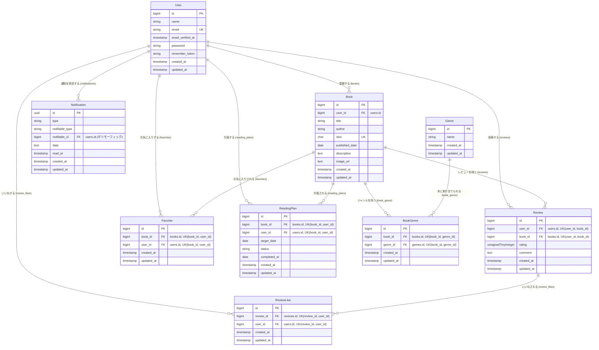

# BookShelf　書籍レビューアプリ

**概要**

書籍レビューアプリケーション「BookShelf」です。
ジャンルによる分類やレビューへのいいね機能、平均評価に基づくランキング機能も備えています。
- ユーザーは書籍を登録・閲覧し、レビューの投稿やお気に入り登録ができます。
- キーワード・ジャンル・並び順を組み合わせた高度な検索機能。
- ISBN-13によるGoogle Books API連携（書籍情報自動取得）。
- マイ読書レポート（統計ダッシュボード）。
- 外部アプリケーション向けの公開API（JSON）も提供し、Sanctum によるトークン認証追加（書き込み系エンドポイントに認証必須）。
- 読書計画機能とリマインダー通知（日次バッチによる通知配信・自動状態遷移）。
---
## URL
- **アプリケーションTOP**: [http://localhost](http://localhost)
- **データベース管理（phpMyAdmin）**: [http://localhost:8080/](http://localhost:8080/)
- **マイ読書レポート**: [http://localhost/reading-report](http://localhost/reading-report)
- **通知一覧**: [http://localhost/notifications](http://localhost/notifications)
---
## 検証用テストアカウント
データベースの初期化シーディング（`sail artisan migrate:fresh --seed`）を実行すると、以下の山田太郎のアカウントに「期日3日前」「期日当日」「期限超過」の全パターンの読書計画・リマインダー通知、およびマイ読書レポート用のデータが集約して生成されます。

### 1. 山田 太郎（全機能・リマインダー検証用メインアカウント）
* **Email**: `yamada@example.com`
* **Password**: `password`

### 2. 鈴木 花子（APIの403認可エラー検証用別アカウント）
* **Email**: `suzuki@example.com`
* **Password**: `password`
---
## 使用技術(開発環境)
- **OS** : macOS Sequoia 15.6
- **Language** : PHP 8.5.7
- **Framework** : Laravel 10.50.2
- **Database** : MySQL 8.4.11
- **Frontend** : Vite, Tailwind CSS ^3.4.0, @tailwindcss/forms
- **Tools** : Docker, Laravel Sail, phpMyAdmin, Postman
---
## Google Books API キーの設定（ISBN自動入力用）
書籍登録画面でISBNから書籍情報を自動補完する機能を利用するには、Google Books APIのアクセスキーが必要です。設定を行わない場合、回数制限エラー（429 Too Many Requests）が発生することがあります。
### 1. API キーの取得手順
1. **Google Cloud Console**（[https://google.com](https://cloud.google.com/cloud-console?%7B_dsmrktparam%7D%7Bignore%7D=&%7B_dsmrktparam%7D=&utm_source=google&utm_medium=cpc&utm_campaign=Cloud-SS-DR-GCP-1713664-GCP-DR-APAC-JP-ja-Google-BKWS-MIX-GenericCloud&utm_content=c-Hybrid+%7C+BKWS+-+BRO+%7C+Txt+-+Generic+Cloud-Console-Cloud+Console-JP_ja-296393718382&utm_term=google%20cloud%20console&gclsrc=aw.ds&gad_source=1&gad_campaignid=12757824394&gclid=CjwKCAjws_DTBhB_EiwAXZknGaw6TTD2T9lExCe1V2mTPCsh7YHwIOiMFCstWhUSAQGk393D-FeN2hoCVqIQAvD_BwE)）にGoogleアカウントでログインします。
2. 画面上部のプロジェクト選択メニューから **「新しいプロジェクト」** を作成します。
3. サイドメニューの「APIとサービス」 > 「ライブラリ」を開き、検索窓に **「Books API」** と入力して選択し、**「有効にする」** をクリックします。
4. 「APIとサービス」 > 「認証情報」画面を開き、画面上部の **「+ 認証情報を作成」** から **「APIキー」** を選択します。
5. 作成された長い文字列（APIキー）をコピーします。
### 2. プロジェクトへの反映方法
- プロジェクト直下の `.env` ファイルを開き、最下部にコピーしたAPIキーを追記してください。
```env
GOOGLE_BOOKS_API_KEY=YourActualAPIKeyHere...
```
- 環境変数をコンテナ（Laravel Sail）環境に確実に同期・反映させるため、キーを入力した後はターミナルで必ず以下のキャッシュリフレッシュコマンドを実行してください。
```bash
sail artisan config:clear
sail artisan optimize:clear
```
> 💡 **注意**: `.env` ファイルはGitの管理対象外（`.gitignore` に登録済み）となっているため、取得した秘密のAPIキーが外部（GitHub等）に公開される心配はありません。
---
## 環境構築
### git cloneでソースをローカル環境にダウンロード

1. プロジェクトを作成したいフォルダに移動してgit cloneでダウンロード

- (応用機能追加したブランチはmain、Advancedです。そのまま環境構築するとmainブランチでダウンロードされます。基本機能はBasicブランチです。)
```bash
git clone https://github.com/NobuyoshiShimada/BookShelf-App.git
```
2. プロジェクトディレクトリに移動
```bash
cd bookshelf-app
```
※基本機能のブランチはBasicへ移動
```bash
cd switch Basic
```
### .envファイルの設定

3. .envファイルを作成する
```bash
cp .env.example .env
```

4. .env ファイルを開き、データベース接続情報が以下と一致していることを確認します。
```bash
DB_CONNECTION=mysql
DB_HOST=mysql
DB_PORT=3306
DB_DATABASE=laravel
DB_USERNAME=sail
DB_PASSWORD=password
```
重要: DB_HOST は localhost や 127.0.0.1 ではなく、Dockerコンテナ名である `mysql` を指定します。

### Laravel sailをインストール

5. Laravel Sailをインストール
```bash
docker run --rm -u "$(id -u):$(id -g)" -v "$(pwd):/var/www/html" -w /var/www/html -e COMPOSER_CACHE_DIR=/tmp/composer_cache laravelsail/php82-composer:latest composer require laravel/sail --dev
```

6. sailの設定ファイルを生成する（MySQLを選択）
```bash
docker run --rm -u "$(id -u):$(id -g)" -v "$(pwd):/var/www/html" -w /var/www/html -e COMPOSER_CACHE_DIR=/tmp/composer_cache laravelsail/php82-composer:latest php artisan sail:install --with=mysql
```
> *MacのM1・M2チップのPCの場合、no matching manifest for linux/arm64/v8 in the manifest list entriesのメッセージが表示されビルドができないことがあります。 エラーが発生する場合は、docker-compose.ymlファイルの「mysql」内に「platform」の項目を追加で記載してください*
``` bash
mysql:
    platform: linux/amd64(←この文を追加)
    image: mysql:8.0.26
    environment:
```

### Sailの起動とエイリアス設定

7. Sailをバックグラウンドで起動
```bash
./vendor/bin/sail up -d
```

8.  エイリアスを設定して 'sail' だけでコマンドを実行できるようにする
```bash
echo "alias sail='[ -f sail ] && bash sail || bash vendor/bin/sail'" >> ~/.zshrc
```

9. シェルを再起動するか、新しいターミナルを開いてエイリアスを有効にする
```bash
exec $SHELL
```

10. アプリケーションキーの作成
``` bash
sail artisan key:generate
```

11. マイグレーションの実行
``` bash
sail artisan migrate --seed
```
※既存のデータベースをリセットしたい場合は以下を実行してください。
`sail artisan migrate:fresh --seed`

### フロントエンドのセットアップ（Vite & Tailwind CSS）

> 本プロジェクトでは、フロントエンドのスタイリングにTailwind CSSを使用します。
以下の手順でセットアップを行ってください。

12. NPM依存パッケージのインストール
```bash
sail npm install
```
※Sailコンテナが起動していることを確認。起動していない場合は ./vendor/bin/sail up -d を実行

13. Alpine.jsのインストール
```bash
sail npm install alpinejs
```

14. Tailwind CSSと @tailwindcss/forms プラグインのインストール
```bash
sail npm install -D tailwindcss@^3.4.0 @tailwindcss/forms postcss autoprefixer
```
※ @tailwindcss/forms はフォーム要素のスタイルをリセットするLaravel標準プラグインです。

15. 設定ファイルの生成
```bash
sail npx tailwindcss init -p
```

16. Tailwind CSSのテンプレートパス設定とforms プラグインの有効化
tailwind.config.js を以下の内容で上書きしてください：
```
import defaultTheme from 'tailwindcss/defaultTheme';
import forms from '@tailwindcss/forms';

/** @type {import('tailwindcss').Config} */
export default {
    content: [
        './vendor/laravel/framework/src/Illuminate/Pagination/resources/views/*.blade.php',
        './storage/framework/views/*.php',
        './resources/views/**/*.blade.php',
    ],
    theme: {
        extend: {
            fontFamily: {
                sans: ['Figtree', ...defaultTheme.fontFamily.sans],
            },
        },
    },
    plugins: [forms],
};
```

17. Vite開発サーバーの起動
```bash
sail npm run dev
```
注意: 開発中は常にこのコマンドを実行した状態にしておいてください。

---
## テストの実行方法（PHPUnit）
本システムでは、PHPUnitおよびLaravelのテスト機能を活用して、アプリケーションの品質（Web画面、公開API、認証機能、データ構造など）をテストしています。
### 1. テストの実行コマンド
状況に応じて以下のコマンドを使い分けてテストを実行します。
- **すべてのテストを一括実行する:**
  ```bash
  sail artisan test
  ```
- **特定のテストファイルのみを個別に実行する:**
  ```bash
  # モデルのリレーションテスト
  sail artisan test tests/Unit/Models

  # 各モデルの単体テスト
  sail artisan test tests/Unit/Models/ExampleTest.php

  # 機能のテスト
  sail artisan test tests/Feature/Web

  # 各機能のテスト
  sail artisan test tests/Feature/Web/ExampleTest.php

  # 公開API機能のテスト
  sail artisan test tests/Feature/Api/V1/BookCudTest.php
  ```
### 2-a. カバレッジを出力しない時
- 通常の開発や、単にテストが成功（`PASS`）するかどうかを確認したい時は、Xdebugを無効化して実行します。
1. `.env` ファイルで `SAIL_XDEBUG_MODE` を空（または `off`）にします。
```env
SAIL_XDEBUG_MODE=off
```
2. 設定を反映するため、コンテナを再起動します（※設定変更時のみ必須）。
```bash
sail down && sail up -d
```
3. テストを実行します。
```bash
# 全件一括実行
sail artisan test

# 特定のファイルをピンポイント実行（例：書籍検索・ソート）
sail artisan test tests/Feature/Web/AdvancedBookSearchSortTest.php
```
### 2-b. カバレッジを出力する時（計測モード）
- 機能追加やリファクタリングが一段落し、**「テストがコードの何％を網羅しているか」を測定・出力したい時**のみ、Xdebugを有効化します。

1. `.env` ファイルを開き、以下の通り設定します。
```env
SAIL_XDEBUG_MODE=coverage
```
2. 設定を読み込ませるため、コンテナを再起動します。
```bash
sail down && sail up -d
```
3. カバレッジテストを実行します。
```bash
# 最適化キャッシュをクリアした上で実行
sail artisan optimize:clear
sail artisan test --coverage
```
> 💡 **下限ガード（`--min=80`）の活用**
> 全体のカバレッジが目標の **80%** に満たない場合に自動的にテストコマンドを失敗（FAIL）させ、コード品質の低下を防ぐことができます。
> `sail artisan test --coverage --min=80`
### 3. 品質レポート（HTML）の出力先と確認方法
- カバレッジテスト（計測モード）を実行すると、どのファイルのどの行がテストを通過したかをブラウザで視覚的に確認できる **HTML形式のグラフィカルな品質レポート** が自動生成されます。

**HTMLレポートの生成コマンド:**
  ```bash
  # テストを実行し、コンテナ内の特定のディレクトリへHTMLレポートを出力します
  sail artisan test --coverage-html html-report
  ```

**品質レポートの出力先（ファイルパス）:**
  プロジェクトルート直下に生成される以下のフォルダ内の **`index.html`** です。
  ```text
  📁 html-report/index.html
  ```

**確認方法:**
  Finder（Mac）やエクスプローラーから、ご自身のPCのローカルにある `html-report/index.html` をダブルクリックしてブラウザ（ChromeやSafari）で開いてください。
  システム全体のコード網羅率が1目でわかり、緑（テスト通過）や赤（未通過の行）に色分けされた詳細な品質レポートを閲覧できます。

---
## 読書計画テストデータ（ReadingPlanSeeder）のシナリオ仕様

日次バッチ（リマインダー通知 ＆ 自動状態遷移）の挙動をローカル環境で即座に検証できるよう、山田太郎（`yamada@example.com`）に対して以下の **7パターンの日付タイムラインシナリオ** が自動生成されます。

| シナリオ名 | 初期ステータス | 期日 (`target_date`) | バッチ実行後（`schedule:work` 等）の挙動 |
| :--- | :---: | :--- | :--- |
| **① 6日前（超過・進行中）** | `reading` | 期日の 6 日前 | ステータスが自動的に **`overdue`（期限超過）** へ遷移。 |
| **② 3日前（超過・未読）** | `reading` | 期日の 3 日前 | ステータスが **`overdue`** へ遷移、かつ **「期日超過通知」** が配信。 |
| **③ 当日（本日が期日）** | `reading` | **期日当日** | ステータスは維持、かつ **「本日締切通知」** が配信。 |
| **④ 3日後（間近の期日）** | `reading` | 期日の 3 日後 | ステータスは維持、かつ **「期日3日前通知」** が配信。 |
| **⑤ 6日後（余裕のある期日）**| `reading` | 期日の 6 日後 | リマインダー対象外のため、通知・遷移ともに発生せずスキップ。 |
| **⑥ 読了（過去に読了済）** | `completed` | 期日の 2 日前 | すでに完了しているため、バッチ処理から安全に除外（スキップ）。 |
| **⑦ 完了済み想定（未来の計画）**| `completed` | 期日の 10 日後 | すでに完了しているため、バッチ処理から安全に除外（スキップ）。 |

> シード直後は①〜⑤のデータが `reading` でインサートされます。ターミナルで **`sail artisan app:send-reading-plan-reminders`** を叩くことで、①と②がパッと赤色の「期限超過」バッジに切り替わり、通知一覧（`/notifications`）に3件のリマインダーが溜まるシミュレーション環境が整います.
---
## 公開APIエンドポイント一覧

書き込み系エンドポイント（POST/PUT/DELETE）には **Laravel Sanctum による Bearer トークン認証**、および Policy クラスによる **所有者限定の認可ガード** が適用されています。

### 書籍管理API (v1/books)
---
| メソッド | パス | 認証 | 機能概要 | クエリパラメータ / リクエストボディ |
| :--- | :--- | :--- | :--- | :--- |
| **GET** | `/v1/` | **不要** | 書籍一覧の取得 (検索・10件ページネーション) | `keyword` (部分一致), `genre_id` (ジャンル絞り込み), `per_page` (最大100) |
| **GET** | `/v1/books/{id}` | **不要** | 特定の書籍の検索・詳細情報取得 | パスパラメータに書籍の `id` を指定 |
| **POST** | `/v1/` | **必須** | 新しい書籍の登録 | `title`, `author`, `isbn`, `published_date`, `description`, `image_url`, `genres` (配列) |
| **PUT** | `/v1/books/{id}` | **必須＋認可** | 登録者本人による書籍情報の更新 | `title`, `author`, `isbn`, `published_date`, `description`, `image_url`, `genres` (配列) |
| **DELETE** | `/v1/books/{id}` | **必須＋認可** | 登録者本人による書籍の削除 | パスパラメータに書籍の `id` を指定 |

### PostmanによるAPIテスト手順 (Sanctum Bearer Token 認証)
---
Postman でテストを行う際は、以下の手順に従ってトークンを発行し、リクエストに付与してください。

**1. 事前準備 (Environment の設定)**

Postmanの`Environments (環境変数)`を新規作成し、以下の変数を登録します。

| Variable (変数名) | Initial Value (初期値の例) | 説明 |
| :--- | :--- | :--- |
| `baseUrl` | `http://localhost` (または `http://127.0.0.1:8000`) | APIサーバーのベースURL |

---
**2. 認証・APIリクエストの3ステップ**
---
#### ステップ 1: APIトークンの発行（ログイン）

まずはユーザー認証を行い、アクセス用のトークンを取得します。

*   **HTTP Method**: `POST`
*   **URL**: `{{baseUrl}}/api/v1/login`
*   **Headers**: 
    *   `Accept: application/json`
*   **Body** (`raw` / `JSON`):
    ```json
    {
        "email": "yamada@example.com",
        "password": "password",
        "device_name": "postman"
    }
    ```
*   **実行**: `Send` をクリックします。成功すると、以下のようにレスポンスの JSON 内にトークン文字列が返却されます。この文字列をコピーします。
    ```json
    {
        "token": "1|abcdefghijklmnopqrstuvwxyz..." 
    }
    ```

---
#### ステップ 2: 書籍一覧の取得（認証不要）
---

認証がかかっていない一般公開APIの疎通を確認します。

*   **HTTP Method**: `GET`
*   **URL**: `{{baseUrl}}/api/v1`
*   **Headers**: 
    *   `Accept`: `application/json`
*   **Query Params** (任意): 
    *   `keyword`: `Laravel`（部分一致検索）
    *   `per_page`: `10`（表示件数制御）
*   **実行**: `Send` をクリックし、認証なしで書籍の JSON データが返ってくれば成功です。

#### 🔒 ステップ 3: 新しい書籍の登録（認証必須）
ステップ 1 で取得したトークンを使用して、保護された登録 API へデータを送信します。

*   **HTTP Method**: `POST`
*   **URL**: `{{baseUrl}}/api/v1`
*   **Headers**: 
    *   `Accept`: `application/json`
*   **Authorization タブ**: 
    *   **Type**: `Bearer Token` を選択
    *   **Token**: コピーしたトークン文字列（`1|...`）をそのまま貼り付け
*   **Body** (`raw` ➔ `JSON`):
    ```json
    {
        "title": "Laravel実践開発ガイド",
        "author": "山田太郎",
        "isbn": "9784000000000",
        "published_date": "2026-08-23",
        "description": "Sanctum認証を通したAPIテストの解説本です。",
        "image_url": "http://example.com",
        "genres": [1, 2]
    }
    ```
*   **実行**: `Send` をクリックし、登録された書籍データ（割り当てられた新規 `id` を含む）が返ってくれば成功です。*(※このとき返ってきた書籍の `id` を次のステップ4, 5で使用します)*

#### ステップ 4: 書籍情報の更新（認証必須 ＋ 所有者認可）
登録した本人として、既存の書籍情報を書き換えます。URLの末尾に操作したい書籍の `{id}` を付与します。

*   **HTTP Method**: `PUT`
*   **URL**: `{{baseUrl}}/api/v1/books/{id}` *(例: `{{baseUrl}}/api/v1/books/5`)*
*   **Headers**: `Accept`: `application/json`
*   **Authorization タブ**: `Bearer Token`（ステップ3と同じトークンを維持）
*   **Body** (`raw` ➔ `JSON`):
    ```json
    {
        "title": "【改訂版】Laravel実践開発ガイド",
        "author": "山田太郎",
        "isbn": "9784000000000",
        "published_date": "2026-08-23",
        "description": "内容を最新情報にアップデートしました。",
        "image_url": "http://example.com",
        "genres": [1, 2, 3]
    }
    ```
*   **実行**: `Send` をクリックし、`200 OK` と共に対象の書籍が書き換わっていれば成功です。

#### ステップ 5: 書籍の削除（認証必須 ＋ 所有者認可）
登録した本人として、書籍データをデータベースから削除します。

*   **HTTP Method**: `DELETE`
*   **URL**: `{{baseUrl}}/api/v1/books/{id}` *(例: `{{baseUrl}}/api/v1/books/5`)*
*   **Headers**: `Accept`: `application/json`
*   **Authorization タブ**: `Bearer Token`（同上）
*   **Body**: なし（空っぽ）
*   **実行**: `Send` をクリックし、`200 OK` などの正常ステータスが返れば削除完了です。

#### ステップ 6: ログアウト（トークンの失効）
テストで使用したトークンをサーバー側（`personal_access_tokens` テーブル）から物理消去します。

*   **HTTP Method**: `POST`
*   **URL**: `{{baseUrl}}/api/v1/logout`
*   **Headers**: `Accept`: `application/json`
*   **Authorization タブ**: `Bearer Token`（同上）
*   **Body**: なし（空っぽ）
*   **実行**: `Send` をクリックし、`200 OK` でログアウト完了のメッセージが返れば全手順終了です。
*   *(※本当に失効したか確認するため、再度そのまま Send を押すと `401 Unauthenticated` が正しく返ります)*
---
### トラブルシューティング

*   **`Error: socket hang up` または `Malformed HTTP request` が出る**
    *   PostmanのURLまたは環境変数が **`https://`** で始まっていないか確認してください。ローカルのSail環境は暗号化に対応していないため、必ず **`http://`**（sなし）でリクエストする必要があります。
*   **`401 Unauthenticated` エラーが返ってくる、またはHTML（ログイン画面）が返る**
    *   リクエストの Headers タブに **`Accept: application/json`** が指定されているか確認してください。これがないと、LaravelはAPIではなくWeb画面用のログイン画面へリダイレクト処理を行ってしまいます。
    *   `Authorization` タブの型が `Bearer Token` になっているか、トークンの前後に余計なスペースが入り込んでいないか確認してください。
*   **`403 Forbidden` エラーが返ってくる**
    *   PUT（更新）や DELETE（削除）を叩く際、**「その書籍を登録した本人」とは別のユーザーのトークン**を使ってリクエストしていないか確認してください。本人以外の操作は認可ポリシー（Policy）によって安全にブロックされます。
---
## テーブル仕様

### 1. users テーブル（ユーザー管理）

| カラム名 | データ型 | 制約 | 説明 |
| :--- | :--- | :--- | :--- |
| **id** | bigint | Primary Key, Auto Increment | ユーザーID |
| **name** | string | Not Null | ユーザー名 |
| **email** | string | Not Null, Unique | メールアドレス |
| **email_verified_at** | timestamp | Nullable | メール確認日時 |
| **password** | string | Not Null | ハッシュ化パスワード |
| **remember_token** | string | Nullable | ログイン保持トークン |
| **created_at** | timestamp | Not Null | レコード作成日時 |
| **updated_at** | timestamp | Not Null | レコード更新日時 |

---
### 2. books テーブル（書籍管理）

| カラム名 | データ型 | 制約 | 説明 |
| :--- | :--- | :--- | :--- |
| **id** | bigint | Primary Key, Auto Increment | 書籍ID |
| **user_id** | bigint | Foreign Key (users.id), Cascade Delete | 登録ユーザーID |
| **title** | string | Not Null | 書籍タイトル |
| **author** | string | Not Null | 著者名 |
| **isbn** | char(13) | Nullable, Unique | ISBNコード (13桁数字) |
| **published_date** | date | Nullable | 出版日 |
| **description** | text | Nullable | 書籍の説明・概要 |
| **image_url** | text | Nullable | 表紙画像のURL |
| **created_at** | timestamp | Not Null | レコード作成日時 |
| **updated_at** | timestamp | Not Null | レコード更新日時 |

---
### 3. reviews テーブル（レビュー管理）

| カラム名 | データ型 | 制約 | 説明 |
| :--- | :--- | :--- | :--- |
| **id** | bigint | Primary Key, Auto Increment | レビューID |
| **user_id** | bigint | Foreign Key (users.id), Cascade Delete | 投稿ユーザーID |
| **book_id** | bigint | Foreign Key (books.id), Cascade Delete | 対象の書籍ID |
| **rating** | unsignedTinyInteger | Not Null (1〜5) | 5段階評価の点数 |
| **comment** | text | Not Null | レビュー本文 |
| **created_at** | timestamp | Not Null | レコード作成日時 |
| **updated_at** | timestamp | Not Null | レコード更新日時 |
| **-** | - | Unique Key (`user_id`, `book_id`) | 1人1冊のみ投稿可能にする制約 |

---
### 4. genres テーブル（ジャンル管理）

| カラム名 | データ型 | 制約 | 説明 |
| :--- | :--- | :--- | :--- |
| **id** | bigint | Primary Key, Auto Increment | ジャンルID |
| **name** | string | Not Null | ジャンル名 (SF, 技術書など) |
| **created_at** | timestamp | Not Null | レコード作成日時 |
| **updated_at** | timestamp | Not Null | レコード更新日時 |

---
### 5. book_genre テーブル（書籍とジャンルの中間テーブル）

| カラム名 | データ型 | 制約 | 説明 |
| :--- | :--- | :--- | :--- |
| **id** | bigint | Primary Key, Auto Increment | 中間レコードID |
| **book_id** | bigint | Foreign Key (books.id), Cascade Delete | 書籍ID |
| **genre_id** | bigint | Foreign Key (genres.id), Cascade Delete | ジャンルID |
| **created_at** | timestamp | Not Null | レコード作成日時 |
| **updated_at** | timestamp | Not Null | レコード更新日時 |
| **-** | - | Unique Key (`book_id`, `genre_id`) | 同一ジャンルの重複登録を防ぐ制約 |

---
### 6. favorites テーブル（書籍のお気に入り中間テーブル）

| カラム名 | データ型 | 制約 | 説明 |
| :--- | :--- | :--- | :--- |
| **id** | bigint | Primary Key, Auto Increment | お気に入りID |
| **book_id** | bigint | Foreign Key (books.id), Cascade Delete | 対象の書籍ID |
| **user_id** | bigint | Foreign Key (users.id), Cascade Delete | お気に入りしたユーザーID |
| **created_at** | timestamp | Not Null | レコード作成日時 |
| **updated_at** | timestamp | Not Null | レコード更新日時 |
| **-** | - | Unique Key (`book_id`, `user_id`) | 同一書籍の重複お気に入りを防ぐ制約 |

---
### 7. review_likes テーブル（レビューのいいね中間テーブル）

| カラム名 | データ型 | 制約 | 説明 |
| :--- | :--- | :--- | :--- |
| **id** | bigint | Primary Key, Auto Increment | いいねID |
| **review_id** | bigint | Foreign Key (reviews.id), Cascade Delete | 対象のレビューID |
| **user_id** | bigint | Foreign Key (users.id), Cascade Delete | いいねしたユーザーID |
| **created_at** | timestamp | Not Null | レコード作成日時 |
| **updated_at** | timestamp | Not Null | レコード更新日時 |
| **-** | - | Unique Key (`review_id`, `user_id`) | 同一レビューの重複いいねを防ぐ制約 |

---
### 8. reading_plans テーブル（読書計画管理）

| カラム名 | データ型 | 制約 | 説明 |
| :--- | :--- | :--- | :--- |
| **id** | bigint | Primary Key, Auto Increment | 計画ID |
| **user_id** | bigint | Foreign Key (users.id), Cascade Delete | 計画を立てたユーザーID |
| **book_id** | bigint | Foreign Key (books.id), Cascade Delete | 対象の書籍ID |
| **target_date** | date | Not Null | 読了の目標期日 |
| **status** | string | Not Null (デフォルト: 'reading') | 計画状態 ('reading', 'completed', 'overdue') |
| **completed_at** | date | Nullable | 読了した期日 |
| **created_at** | timestamp | Not Null | レコード作成日時 |
| **updated_at** | timestamp | Not Null | レコード更新日時 |
| **-** | - | Unique Key (`user_id`, `book_id`) | 同一書籍に対する重複計画を防ぐ制約 |

---
### 9. notifications テーブル（通知管理）

| カラム名 | データ型 | 制約 | 説明 |
| :--- | :--- | :--- | :--- |
| **id** | uuid | Primary Key | 通知ID (UUID) |
| **type** | string | Not Null | 通知の種別 (通知クラス名) |
| **notifiable_type** | string | Not Null | 通知対象のモデル名 (`App\Models\User`) |
| **notifiable_id** | bigint | Not Null | 受信者のユーザーID(`user_id`) |
| **data** | text | Not Null | 通知内容 (タイトルや書籍ID等のJSONデータ) |
| **read_at** | timestamp | Nullable | 既読日時 (未読の場合は Null) |
| **created_at** | timestamp | Not Null | レコード作成日時 |
| **updated_at** | timestamp | Not Null | レコード更新日時 |

---
## ER図

```mermaid
erDiagram
    User ||--o{ Book : "登録する (books)"
    User ||--o{ Review : "投稿する (reviews)"
    User ||--o{ Favorite : "お気に入りする (favorites)"
    User ||--o{ ReviewLike : "いいねする (review_likes)"
    User ||--o{ ReadingPlan : "計画する (reading_plans)"
    User ||--o{ Notification : "通知を受信する (notifications)"
    
    Book ||--o{ Review : "レビューを持つ (reviews)"
    Book ||--o{ BookGenre : "ジャンルを持つ (book_genre)"
    Book ||--o{ Favorite : "お気に入りされる (favorites)"
    Book ||--o{ ReadingPlan : "計画される (reading_plans)"

    
    Genre ||--o{ BookGenre : "本に割り当てられる (book_genre)"
    Review ||--o{ ReviewLike : "いいねされる (review_likes)"

    User {
        bigint id PK
        string name
        string email UK
        timestamp email_verified_at
        string password
        string remember_token
        timestamp created_at
        timestamp updated_at
    }

    Book {
        bigint id PK
        bigint user_id FK "users.id"
        string title
        string author
        char isbn UK
        date published_date
        text description
        text image_url
        timestamp created_at
        timestamp updated_at
    }

    Review {
        bigint id PK
        bigint user_id FK "users.id, UK(user_id, book_id)"
        bigint book_id FK "books.id, UK(user_id, book_id)"
        unsignedTinyInteger rating
        text comment
        timestamp created_at
        timestamp updated_at
    }

    Genre {
        bigint id PK
        string name
        timestamp created_at
        timestamp updated_at
    }

    BookGenre {
        bigint id PK
        bigint book_id FK "books.id, UK(book_id, genre_id)"
        bigint genre_id FK "genres.id, UK(book_id, genre_id)"
        timestamp created_at
        timestamp updated_at
    }

    Favorite {
        bigint id PK
        bigint book_id FK "books.id, UK(book_id, user_id)"
        bigint user_id FK "users.id, UK(book_id, user_id)"
        timestamp created_at
        timestamp updated_at
    }

    ReviewLike {
        bigint id PK
        bigint review_id FK "reviews.id, UK(review_id, user_id)"
        bigint user_id FK "users.id, UK(review_id, user_id)"
        timestamp created_at
        timestamp updated_at
    }

    ReadingPlan {
        bigint id PK
        bigint book_id FK "books.id, UK(book_id, user_id)"
        bigint user_id FK "users.id, UK(book_id, user_id)"
        date target_date
        string status
        date completed_at
        timestamp created_at
        timestamp updated_at
    }

    Notification {
        uuid id PK
        string type
        string notifiable_type
        bigint notifiable_id FK "users.id (ポリモーフィック)"
        text data
        timestamp read_at
        timestamp created_at
        timestamp updated_at
    }
```
---
## 作成者
島田 延佳

( Nobuyoshi Shimada )

