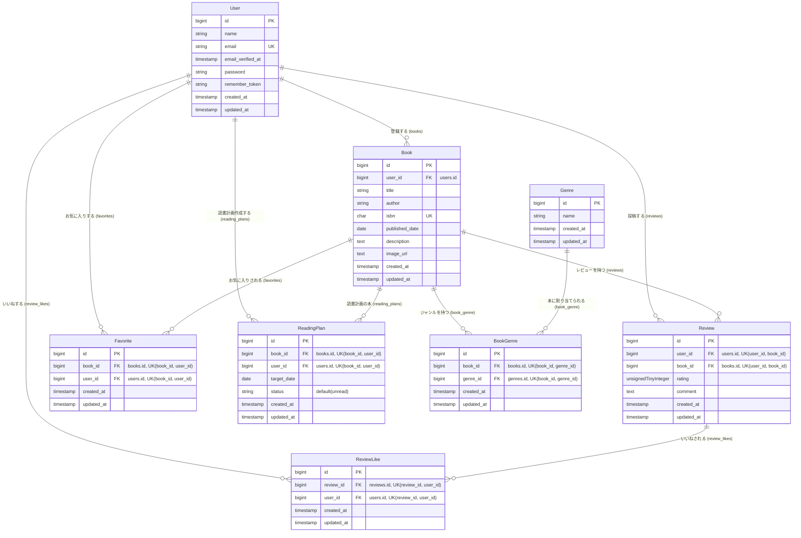

```mermaid
erDiagram
    User ||--o{ Book : "登録する (books)"
    User ||--o{ Review : "投稿する (reviews)"
    User ||--o{ Favorite : "お気に入りする (favorites)"
    User ||--o{ ReviewLike : "いいねする (review_likes)"
    User ||--o{ ReadingPlan : "読書計画作成する (reading_plans)"
    
    Book ||--o{ Review : "レビューを持つ (reviews)"
    Book ||--o{ BookGenre : "ジャンルを持つ (book_genre)"
    Book ||--o{ Favorite : "お気に入りされる (favorites)"
    Book ||--o{ ReadingPlan : "読書計画の本 (reading_plans)"

    
    Genre ||--o{ BookGenre : "本に割り当てられる (book_genre)"
    Review ||--o{ ReviewLike : "いいねされる (review_likes)"

    User {
        bigint id PK
        string name
        string email UK
        timestamp email_verified_at
        string password
        string remember_token
        timestamp created_at
        timestamp updated_at
    }

    Book {
        bigint id PK
        bigint user_id FK "users.id"
        string title
        string author
        char isbn UK
        date published_date
        text description
        text image_url
        timestamp created_at
        timestamp updated_at
    }

    Review {
        bigint id PK
        bigint user_id FK "users.id, UK(user_id, book_id)"
        bigint book_id FK "books.id, UK(user_id, book_id)"
        unsignedTinyInteger rating
        text comment
        timestamp created_at
        timestamp updated_at
    }

    Genre {
        bigint id PK
        string name
        timestamp created_at
        timestamp updated_at
    }

    BookGenre {
        bigint id PK
        bigint book_id FK "books.id, UK(book_id, genre_id)"
        bigint genre_id FK "genres.id, UK(book_id, genre_id)"
        timestamp created_at
        timestamp updated_at
    }

    Favorite {
        bigint id PK
        bigint book_id FK "books.id, UK(book_id, user_id)"
        bigint user_id FK "users.id, UK(book_id, user_id)"
        timestamp created_at
        timestamp updated_at
    }

    ReviewLike {
        bigint id PK
        bigint review_id FK "reviews.id, UK(review_id, user_id)"
        bigint user_id FK "users.id, UK(review_id, user_id)"
        timestamp created_at
        timestamp updated_at
    }

        ReadingPlan {
        bigint id PK
        bigint book_id FK "books.id, UK(book_id, user_id)"
        bigint user_id FK "users.id, UK(book_id, user_id)"
        date target_date
        string status "default(unread)"
        timestamp created_at
        timestamp updated_at
    }

```
